- [1. 创建Google Cloud 项目](#1---google-cloud---)
  * [1.1 登录google cloud platform](#11---google-cloud-platform)
  * [1.2 新建项目](#12-----)
    + [1.2.1 步骤1：](#121---1-)
    + [1.2.2 步骤2：](#122---2-)
  * [1.3 为该项目创建服务账号](#13-----------)
    + [1.3.1 什么是服务账号？](#131---------)
    + [1.3.2 创建步骤](#132-----)
      - [1.3.2.1 步骤1](#1321---1)
      - [1.3.2.2 步骤2](#1322---2)
      - [1.3.2.3 步骤3](#1323---3)
  * [1.4 为该服务账号创建其密匙](#14------------)
    + [1.4.1 步骤1](#141---1)
    + [1.4.2 步骤2](#142---2)
  * [1.5 最佳做法与解决方案](#15----------)
    + [1.5.1 谷歌技术人员给出的建议：](#151-------------)
    + [1.5.2 具体步骤：](#152------)
    + [3. 设置环境变量](#3-------)
      - [3.1 windows+pycharm的环境变量设置。](#31-windows-pycharm--------)
      - [3.2 linux, mac用户的环境变量设置](#32-linux--mac---------)
- [2.代理的操作：](#2------)
  * [2.1 代理的创建](#21------)
  * [2.2 代理的导入](#22------)
  * [2.3 代理的导出](#23------)
  * [2.4 代理的删除](#24------)
- [3. dialogflow 控制台面板功能介绍](#3-dialogflow----------)
  * [3.1 Build](#31-build)
  * [3.2 Manage](#32-manage)
  * [3.3 Agent Test](#33-agent-test)
  * [3.4 Agent settings](#34-agent-settings)
- [4. 流、页面、意图、实体、参数的概念](#4-----------------)
  * [4.1 流](#41--)
      - [4.1.1 流的特点](#411-----)
      - [4.1.2 流的初始页面](#412-------)
      - [4.1.3 流的增、删、导出、导入](#413------------)
        * [4.1.3.1 增加流：](#4131-----)
        * [4.1.3.2 删除流：](#4132-----)
        * [4.1.3.3 导出流：](#4133-----)
        * [4.1.3.2 导入流：](#4132-----)
  * [4.2 页面](#42---)
    + [4.2.1 页面的特点：](#421-------)
    + [4.2.2 页面的功能](#422------)


# 1. 创建Google Cloud 项目

## 1.1 登录google cloud platform

[登录链接](https://console.cloud.google.com/user-preferences/cloud-profile)

## 1.2 新建项目

### 1.2.1 步骤1：

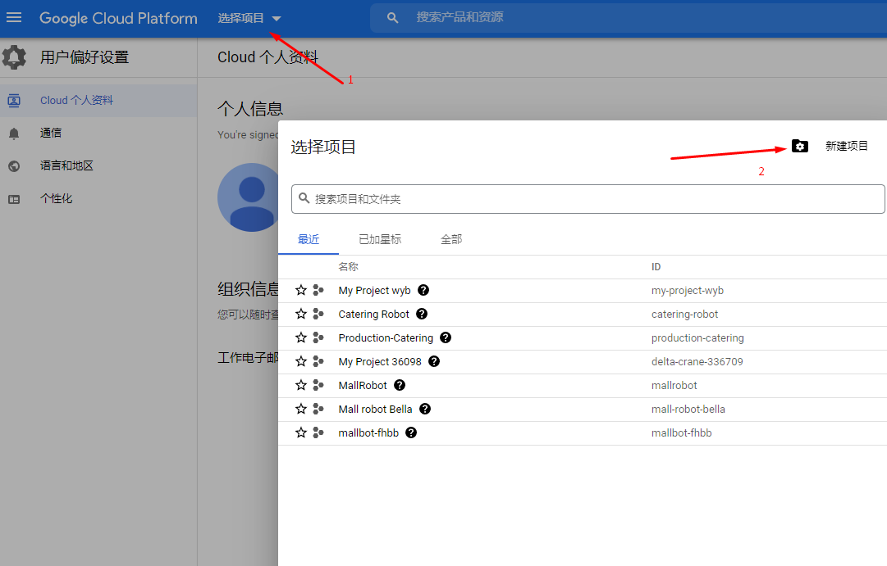


### 1.2.2 步骤2：

​			注：一个google 账号可以创建25个项目，如需要创建更多项目，需要申请开通。

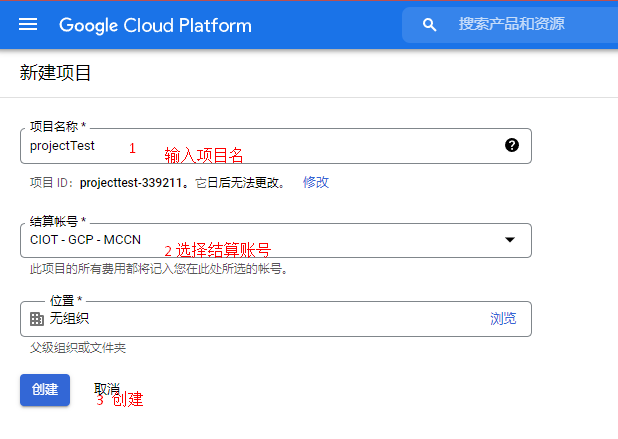

​				稍等几分钟，刷新 google cloud platform, 刚创建的项目已经展示在项目列表里

​				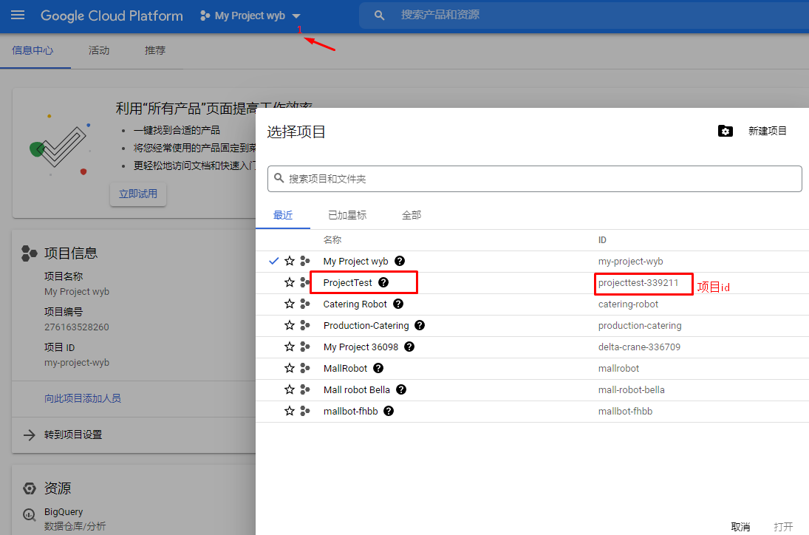


## 1.3 为该项目创建服务账号 

### 1.3.1 什么是服务账号？

是一个供计算机用的虚拟账号，用来访问Google Cloud资源。
[链接](https://cloud.google.com/iam/docs/service-accounts?hl=zh-cn&_ga=2.98308319.-139742340.1639388700)

### 1.3.2 创建步骤

#### 1.3.2.1 步骤1
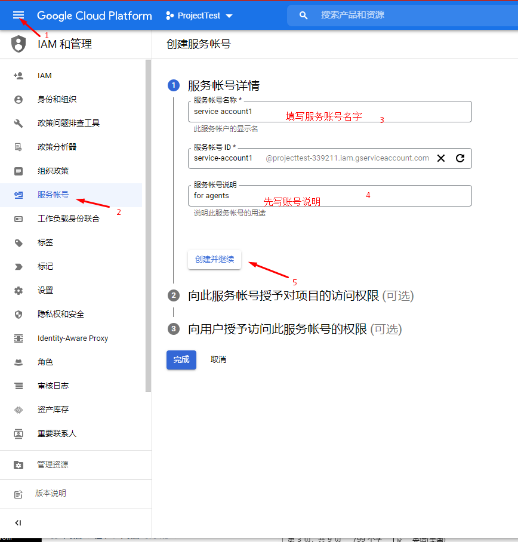

#### 1.3.2.2 步骤2 

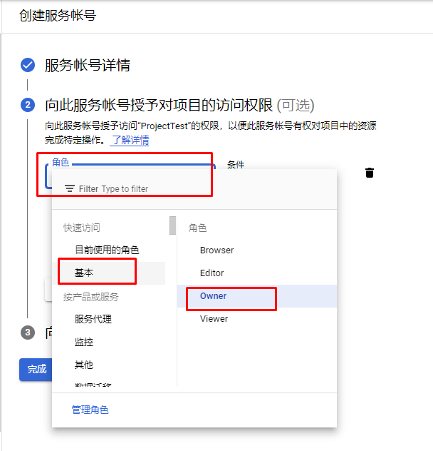

#### 1.3.2.3 步骤3

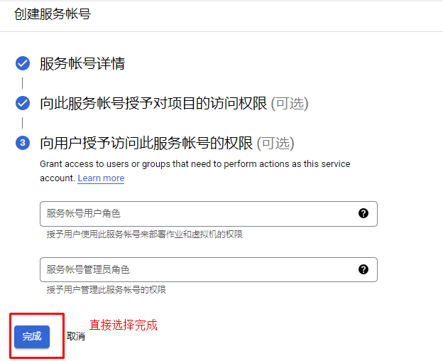


## 1.4 为该服务账号创建其密匙

### 1.4.1 步骤1


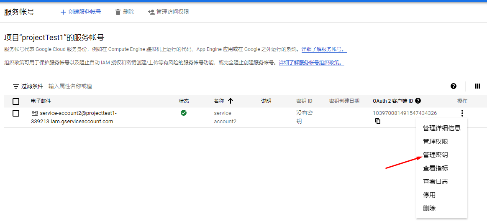

### 1.4.2 步骤2
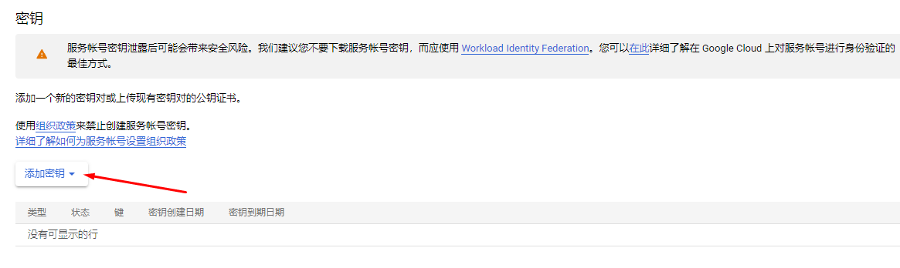


选择json,点击创建后自动下载json格式的密匙，稍后将会用到。

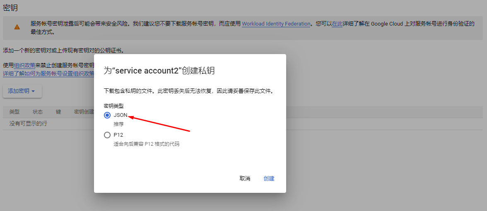

## 1.5 最佳做法与解决方案

### 1.5.1 谷歌技术人员给出的建议：
为一个谷歌项目创建其对应的服务账号，如果有多个谷歌项目，就需要多个服务账号，这样方便账单的计算。 这样基于最小权限原则，对项目管理也相对安全。 

基于公司的业务需求，服务账号该以如下方法进行管理。 

客观因素：
1. 在linux环境变量中只能设置一个json密匙。
2. 一个谷歌项目对应一个的dialogflow cx项目，一个谷歌项目需要一个与之对应的服务账号，一个服务账号可以选择生成或者不生成密匙。通过密匙，我们可以使用客户端或者API的方式访问该dialogflow cx项目的相关信息和功能，使用项目A的json密匙不可以访问项目B的任何信息，这导致了我们无法用一个把密匙访问多个dialogflow cx项目。

解决方法：

将其中一个服务账号作为父账号，其功能是生成json密匙，我们可以根据需求将父账号的作为owner的角色添加到子账号。 谷歌的服务账号本身并没有父子等级关系，这样做完全基于公司的的业务管理需求。
以此达到了使用一把json密匙，访问到多个dialogflow cx项目

### 1.5.2 具体步骤：
假如现在有两个project，分别为projectTest1，catering Robot。 这两个项目都已经通过上面的方式建立了自己的服务账号，我们想要做到用catering Robot的密匙访问projectTest1.

步骤1：
复制catering Robot的服务账号。

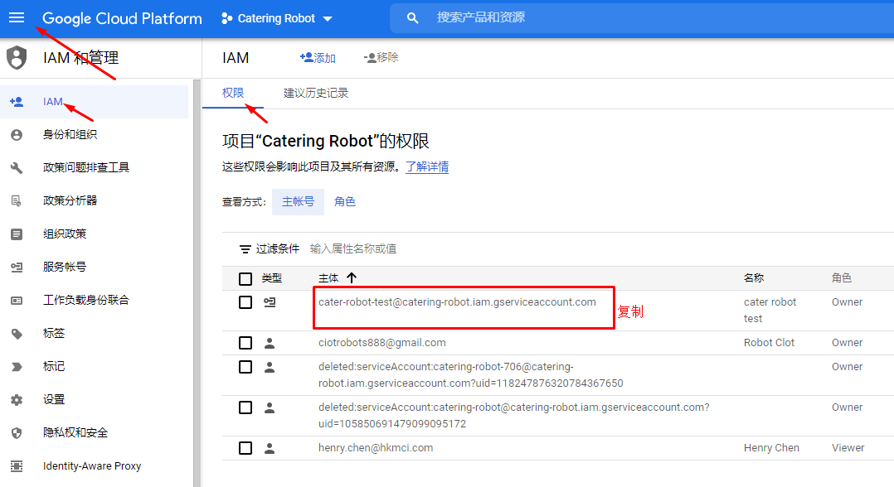

步骤2：
添加catering robot的服务账号到projectTest1，并给予owner权限。

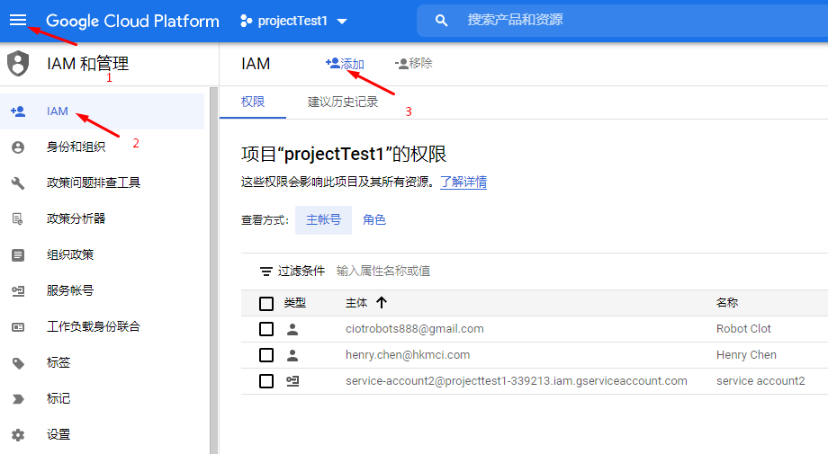

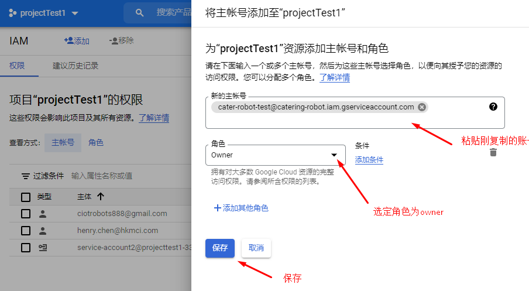


### 3. 设置环境变量

[链接](https://cloud.google.com/iam/docs/service-accounts?hl=zh-cn&_ga=2.98308319.-139742340.1639388700)

拿到上一步下载的json密匙绝对路径

#### 3.1 windows 用户的环境变量设置

前提：
windows+pycharm 

以下配置方法生效范围为整个pycharm项目目录

假设你的json密匙绝对路径为：C:\Users\admin\xxxx\xxxbcb6202b4.json

环境变量格式： GOOGLE_APPLICATION_CREDENTIALS=C:\Users\admin\xxxx\xxxbcb6202b4.json

选中pycharm项目中任一py文件，单击右上角。

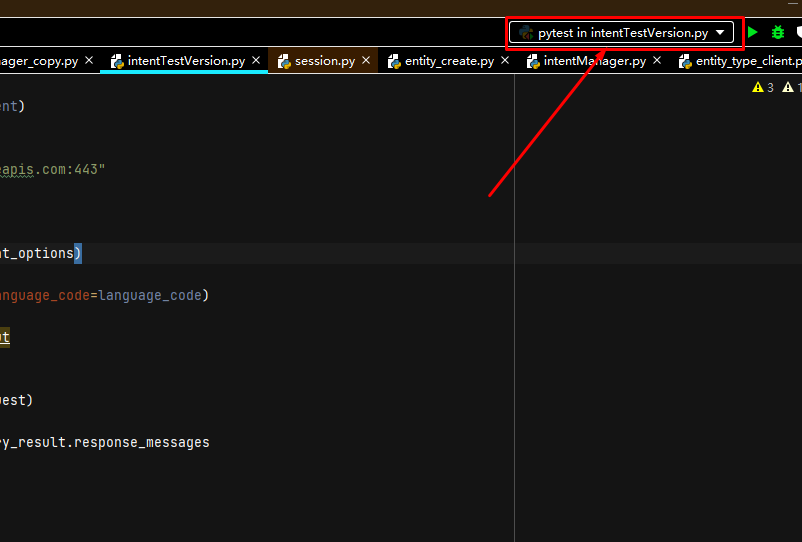

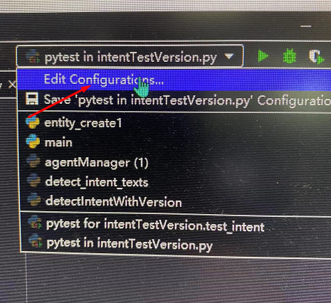

在红色框出输入GOOGLE_APPLICATION_CREDENTIALS=C:\Users\admin\xxxx\xxxbcb6202b4.json

点击apply，这样你就可以访问谷歌项目了。


#### 3.2 linux, mac 用户的环境变量设置

可以直接把json密匙路径配置到用户环境变量，生效范围为该linux系统的用户，当然你也可也设置linux系统级的环境变量（参照链接：https://www.cnblogs.com/lihao-blog/p/6945040.html）

下面展示把json密匙配置到linux用户级的环境变量。

1 进入用户的根目录

cd  $HOME 或 cd ~

$ vim  .bashrc

2 然后打开.bashrc若不存在则新建.bashrc文件

vim  .bashrc

3 在.bashrc页面最后加上想要加的路径

export GOOGLE_APPLICATION_CREDENTIALS=/var/www_r/www_bot/catering-robot-aecbcb6202b4.json

请将json密匙的地址替换为你的绝对路径。

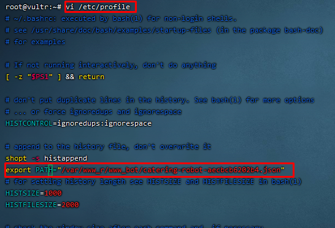

4 最后执行

source ~/.bashrc

搞定！


# 2.代理的操作：
## 2.1 代理的创建
我们可以通过API、客户端、控制台创建代理
这里仅展示通过控制台、客户端创建代理。
### 2.1.1 通过控制台创建
登录后，在project下拉框，你会发现刚刚创建的google could 项目 projectTest已经显示到了这里。

1.点击 Enable API ->create agent

下面截图说明：

Displayname: 代理名字，一个location下的代理名字不能重复，

location：代理所在的google服务器的区域，这会影响到意图识别的访问速度，建议就近原则。代理位置一旦选定，不可以改变。 

Default language：代理使用的语言，这决定了意图识别、实体的主要语言，一个代理只能选中一门语言作为主识别语言。 虽然你可以把多国语言作为训练语句加入意图，但这样做不利于管理。 

Time zone：代理所用的时间

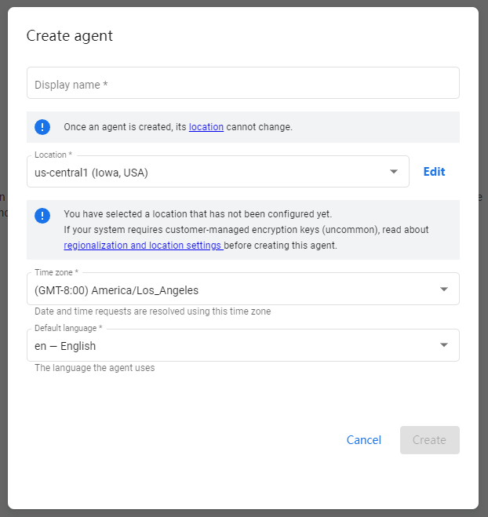

代理创建说明：
dialogflow代理id为谷歌自动生成，创建代理成功后可以通过API或者客户端库拿到代理的id，也可以在控制台的导航栏查看代理的id。

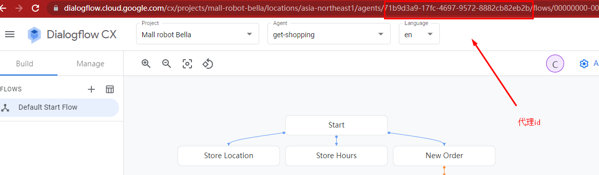


一个google dialogflow cx项目（也叫google cloud项目）下可以创建1000个代理，具体参数限制如下表。

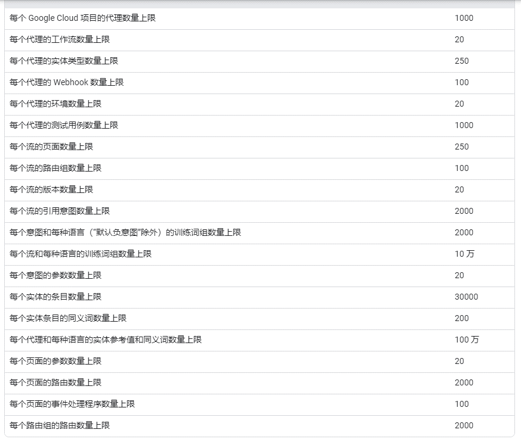
### 2.1.2 通过客户端创建
#### 2.1.2.1 创建代理需要传入参数
project_id：项目id， 这个可以通过复制dialogflow控制台拿到</br>
location：代理所在的谷歌服务器区域，目前已经开通12个服务区域</br>
time_zone：代理所使用的时间</br>
language_code：代理所使用的主识别语言</br>
display_name： 给代理取名，注意一个区域下的代理名字不能重复</br>
#### 2.1.2.2 代理的可选时区、语言、区域表

更新时间2022.1.25

区域：<br/>
```python
'''
us-central1 (Iowa, USA)<br/>
us-east1 (South Carolina, USA)<br/>
us-west1 (Oregon, USA)<br/>
asia-northeast1 (Tokyo, Japan)<br/>
asia-south1 (Mumbai, India)<br/>
asia-southeast1 (Jurong West, Singapore)
australia-southeast1 (Sydney, Australia)
northamerica-northeast1 (Montréal, Québec, Canada)
europe-west1 (St. Ghislain, Belgium)
europe-west2 (London, England, UK)
europe-west3 (Frankfurt, Germany)
global (Global serving, data-at-rest in US)
'''
```

语言：<br/>
```python
'''
af — Afrikaans
am — Amharic
ar — Arabic
az — Azerbaijani
be — Belarusian
bg — Bulgarian
bn — Bengali
bs — Bosnian
ca — Catalan
ceb — Cebuano
co — Corsican
cs — Czech
cy — Welsh
da — Danish
de — German
el — Greek
en — English
eo — Esperanto
es — Spanish
et — Estonian
eu — Basque
fa — Persian
fi — Finnish
fil — Filipino
fr — French
fy — Frisian
ga — Irish
gd — Scots
gl — Galician
gu — Gujarati
ha — Hausa
hi — Hindi
hmn — Hmong
hr — Croatian
ht — Haitian
hu — Hungarian
hy — Armenian
id — Indonesian
ig — Igbo
is — Icelandic
it — Italian
iw — Hebrew
ja — Japanese
jv — Javanese
ka — Georgian
kk — Kazakh
km — Khmer
kn — Kannada
ko — Korean (South Korea)
ku — Kurdish
ky — Kyrgyz
la — Latin
lb — Luxembourgish
lt — Lithuanian
lv — Latvian
mg — Malagasy
mi — Maori
mk — Macedonian
ml — Malayalam
mn — Mongolian
mr — Marathi
ms — Malay
mt — Maltese
ne — Nepali
nl — Dutch
no — Norwegian
ny — Chichewa
or — Odia
pa — Punjabi
pl — Polish
ps — Pashto
pt — Portuguese (European)
pt-br — Portuguese (Brazilian)
ro — Romanian
ru — Russian
rw — Kinyarwanda
sd — Sindhi
si — Sinhala
sk — Slovak
sl — Slovenian
sm — Samoan
sn — Shona
so — Somali
sq — Albanian
sr — Serbian
st — Sesotho
su — Sundanese
sv — Swedish
sw — Swahili
ta — Tamil
te — Telugu
tg — Tajik
th — Thai
tk — Turkmen
tr — Turkish
tt — Tatar
ug — Uyghur
uk — Ukrainian
ur — Urdu
uz — Uzbek
vi — Vietnamese
xh — Xhosa
yi — Yiddish
yo — Yoruba
zh-cn — Chinese (Simplified)
zh-hk — Chinese (Hong Kong)
zh-tw — Chinese (Traditional)
zu — Zulu
'''
```


时区：
``` python
'''
(GMT+1:00) Africa/Casablanca
(GMT-9:00) America/Anchorage
(GMT-4:00) America/Barbados
(GMT-3:00) America/Buenos_Aires
(GMT-6:00) America/Chicago
(GMT-7:00) America/Denver
(GMT-8:00) America/Los_Angeles
(GMT-5:00) America/New_York
(GMT+6:00) Asia/Almaty
(GMT+7:00) Asia/Bangkok
(GMT+5:30) Asia/Colombo
(GMT+4:00) Asia/Dubai
(GMT+8:00) Asia/Hong_Kong
(GMT+4:30) Asia/Kabul
(GMT+5:45) Asia/Kathmandu
(GMT+6:30) Asia/Rangoon
(GMT+9:00) Asia/Tokyo
(GMT+5:00) Asia/Yekaterinburg
(GMT-1:00) Atlantic/Cape_Verde
(GMT-2:00) Atlantic/South_Georgia
(GMT+9:30) Australia/Darwin
(GMT+10:00) Australia/Sydney
(GMT-12:00) Etc/GMT+12
(GMT+2:00) Europe/Kaliningrad
(GMT) Europe/London
(GMT+1:00) Europe/Madrid
(GMT+3:00) Europe/Moscow
(GMT+12:00) Pacific/Fiji
(GMT-10:00) Pacific/Honolulu
(GMT-11:00) Pacific/Midway
(GMT+11:00) Pacific/Noumea
(GMT+13:00) Pacific/Tongatapu
(GMT-9:00) US/Alaska
'''
```

#### 2.1.2.3 代码段
只要使用 dialogflow 客户端，就必须先安装客户端库：</br>
安装命令为：</br>
$pip install google-cloud-dialogflow-cx

请根根据实际情况传入参数。
[文档链接](https://googleapis.dev/python/dialogflow-cx/latest/dialogflowcx_v3beta1/agents.html)

```python
from google.cloud.dialogflowcx_v3beta1.types import CreateAgentRequest,CreateAgentRequest,Agent
from google.cloud.dialogflowcx_v3beta1.types.agent import ListAgentsRequest,ExportAgentRequest,RestoreAgentRequest
from google.cloud.dialogflowcx_v3beta1.services.agents import AgentsClient
import uuid

def crateAgent(project_id='catering-robot',location='asia-northeast1',time_zone='Asia/Hong_Kong',language_code='en'):
    agent_name_uuid = str(uuid.uuid4())
    agent_name_base = 'cateringAgent'
    agent_readable_name = agent_name_base + agent_name_uuid
    agent_id = str(uuid.uuid4())
    agent = Agent()
    agent.display_name = agent_readable_name
    agent.default_language_code = language_code
    agent.time_zone = time_zone

    parent = f'projects/{project_id}/locations/{location}'
    create_agent_request = CreateAgentRequest(parent=parent,agent=agent)
    agentClient = AgentsClient(client_options={"api_endpoint": f"{location}-dialogflow.googleapis.com"})
    agent_response= agentClient.create_agent(create_agent_request)
    print(agent_response)
    
```

## 2.2 代理的导出
### 2.2.1 使用控制台导出
步骤1</br>

步骤2</br>


### 2.2.2 使用客户端库导出
[文档链接](https://googleapis.dev/python/dialogflow-cx/latest/dialogflowcx_v3beta1/agents.html)

这里只是为了展示代理导出的功能才使用while True，实际项目中，请不要这样使用。</br>
下面代码段的功能是导出指定环境的代理,当然如果不指定环境，你导出的将是草稿代理。</br>
拿到指定环境的代理最直接的方法是从控制台复制，如下图</br>


```python
from google.cloud.dialogflowcx_v3beta1.types import CreateAgentRequest,CreateAgentRequest,Agent
from google.cloud.dialogflowcx_v3beta1.types.agent import ListAgentsRequest,ExportAgentRequest,RestoreAgentRequest
from google.cloud.dialogflowcx_v3beta1.services.agents import AgentsClient
import uuid
import time

def exportAgent(agent_path_environment):
    agent_path = agent_path_environment.split('/environment')[0]
    location = AgentsClient.parse_agent_path(agent_path)['location']
    agentClient = AgentsClient(client_options={"api_endpoint": f"{location}-dialogflow.googleapis.com"})


    request = ExportAgentRequest(name=agent_path,environment=agent_path_environment)
    export_operation = agentClient.export_agent(request)


    while export_operation.done==False:
        time.sleep(1)
        print('not completed yet')

    else:
        response =export_operation.result()
        response_content = response.agent_content
        print(response_content)

if __name__ == '__main__':
    agent_path = 'projects/catering-robot/locations/asia-northeast1/agents/8329fd03-417c-43fd-9520-ed5c8ae0d1d6/environments/573b3604-5d72-4b91-9374-c9f226e6800c'
    exportAgent(agent_path)
    


```

## 2.3 代理的导入
### 2.3.1 通过控制台导入
步骤1：

步骤2：
选中被需要被导入的代理->上传本地的代理文件->导入 </br>
注意：根据需要备份被导入的代理，一旦执行restore操作，将会把现有草稿代理覆盖，之前草稿代理的所有数据会被清空。


### 2.3.2 通过客户端库导入
步骤：</br>
- 先导出一个代理，那到该代理的二进制文件
- 通过新建一个代理或者使用现有的代理，然后执行导入操作。
以下代码段仅展示效果，可参照客户端库文件了解详细导入操作
[文档链接](https://googleapis.dev/python/dialogflow-cx/latest/dialogflowcx_v3beta1/agents.html)

``` python 
from google.cloud.dialogflowcx_v3beta1.types import CreateAgentRequest,CreateAgentRequest,Agent
from google.cloud.dialogflowcx_v3beta1.types.agent import ListAgentsRequest,ExportAgentRequest,RestoreAgentRequest
from google.cloud.dialogflowcx_v3beta1.services.agents import AgentsClient
import uuid
import time

def restore_agent(agent,agent_binary):
    location = AgentsClient.parse_agent_path(agent)['location']
    agentClient = AgentsClient(client_options={"api_endpoint": f"{location}-dialogflow.googleapis.com"})
    request = RestoreAgentRequest(name=agent,agent_content=agent_binary)

    restore_operation = agentClient.restore_agent(request=request)
    start = time.time()
    while restore_operation.done==False:
        time.sleep(1)

        print('not completed yet')
    else:
        end = time.time()
        print(f'agent updated, timeout:{end-start}')
        
if __name__ == '__main__':
    agent_path = 'projects/catering-robot/locations/asia-northeast1/agents/8329fd03-417c-43fd-9520-ed5c8ae0d1d6/environments/573b3604-5d72-4b91-9374-c9f226e6800c'
    agent_binary = exportAgent(agent_path)
    agent_to_be_restored= 'projects/catering-robot/locations/asia-northeast1/agents/15439d0d-2893-42da-bbba-cc85c4825675'


```

## 2.4 代理的删除
### 2.4.1 通过控制台删除
步骤1：

步骤2：


### 2.4.2 通过客户端库删除
待更新......</r>
通过客户端库删除代理的方法可参照代理的创建代码段， 


# 3. Dialogflow 控制台面板功能介绍

## 3.1 Build


## 3.2 Manage

Resources:

在这里可以管理意图、实体类型、网络钩子、路由组

Test & Feedback：

这里包含了代理的测试和分析功能

TESTING $DEPLOYMENT:

在这里可以进行流的版本控制，代理的环境管理等操作。

INTERGRETION:

代理与第三方平台的集成

Prebuild Agent：

谷歌预设好的代理。 

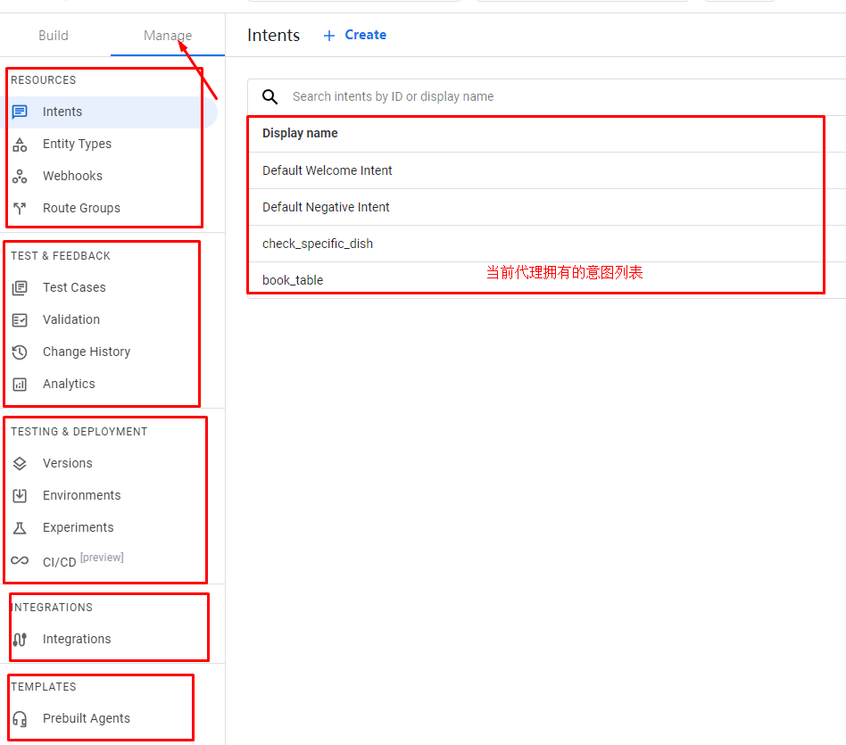

## 3.3 Agent Test

点击右边test Agent可对创作好的代理进行测试。

我在测试窗口中输入了 when is your store hours 

测试窗口:</br>

- Default start flow 代表流名字，这里指页面Strore Hours所在的流名。

- Strore Hours 代表页面名字,这里指意图store.hours所在的页面名字。

- store.hours 是当如输入测试语句后所命中的意图名。

- 点击小本本图标可以看到当前会话返回的详细json参数。

- 点击垃圾箱的图标会清除当前会话的所有数据，再次输入语句测试的时候就会生成一个新的session id测试控制台的代理。

- Execution steps： 点击下拉框可以看到当前会话的从开始到当前状态的执行步骤。

- Environment: Draft:  这里的意思是当前测试的是草稿代理，如果您建立了代理版本打开测试代理就会弹出代理版本供您选择测试。

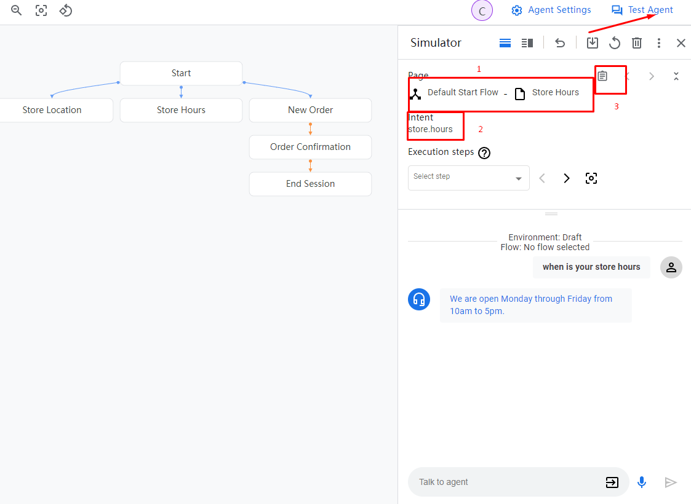

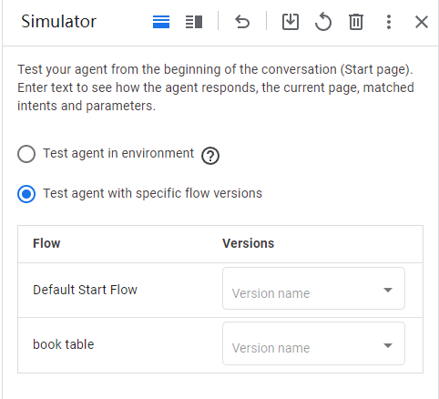


## 3.4 Agent settings

点击控制台右上角Agent setting->ML </br>

参数说明：</br>

- NLU type：</br>

这里是默认选择了标准NLU, 标准NLU会在更改草稿后自动训练，如果选择Advanced NLU，每次更新流就必须手动训练，这个选项适合大型流。 </br>

- Classification thredshould：<br>

意图检测的阈值，如果意图匹配的置信度分数小于阈值，则会调用[无匹配事件](https://cloud.google.com/dialogflow/cx/docs/concept/handler#event-built-in)

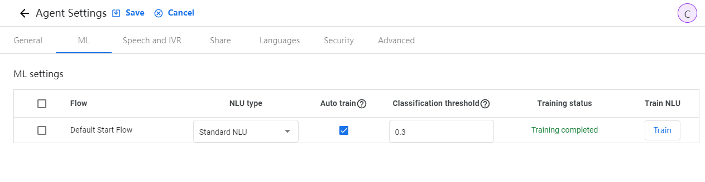


# 4. 流、页面、意图、实体的概念和用法

## 4.1 流

### 4.1.1 流的特点

- 每个代理有且仅有一个默认初始流Default start flow[默认初始流](https://cloud.google.com/dialogflow/cx/docs/concept/flow#start)的流，这是一轮对话的入口。对于简单的代理，您可能只需要这一个流。较复杂的代理可能需要更多的流，不同的开发团队成员可以负责构建和维护这些流。也就是当业务广或很复杂的时候，我们可以把功能抽象出来，用一个流执行一类的功能操作，这样方便流的管理和后期流的版本控制。

- 多个流之间可以相互协作，数据可以共享。 

- 默认初始流的ID为00000000-0000-0000-0000-000000000000

- 每个流都有一个默认的start page，在调用该代理的API或使用客户端时，可以通过 pageId=START_PAGE 判断是否为开始流。


### 4.1.3 流的增、删、导出、导入

流的操作有三种方式:</br>
1.通过API ([链接](https://cloud.google.com/dialogflow/cx/docs/concept/flow))。 </br>
2.通过客户端([链接](https://googleapis.dev/python/dialogflow-cx/latest/dialogflowcx_v3beta1/services.html#google.cloud.dialogflowcx_v3beta1.services.flows.FlowsClient))。</br>
3.通过控制台。 下面展示了通过控制台创建流。</br>


#### 4.1.3.1 增加流：

在dialogflow cx 控制台 ->点击build-> 点击 + 号->点击create flow->输入流名 ->回车保存</br>

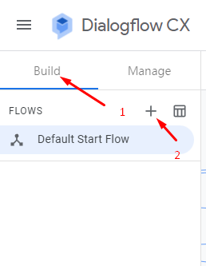

##### 4.1.3.2 删除流：

打开dialogflow cx 控制台 ->点击build-> 点击 + 号->点击Delete->输入流名 ->回车保存 </br>

建议的做法：</br>

删除某个流的时候需要注意与之关联的页面、流等信息，要确保删除后其他页面或者流不受影响，如果该流以后可能需要，可以选择导出存到本地，或者为该流保存一个版本，关于流的版本，请参照流的版本控制。</br>

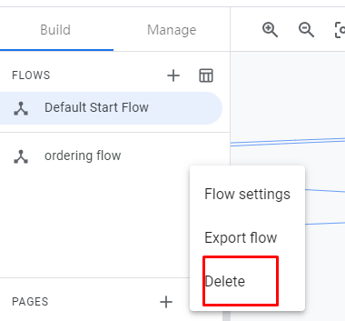


##### 4.1.3.3 导出流：

打开dialogflow cx 控制台 ->鼠标移到要导出的流->点击三个点->点击Export flow ->回车保存</br>

关于导出的位置有两个选项：</br>

Cloud storage：把流存到谷歌云服务器，这个服务要额外购买。</br>

Download：存到本地</br>

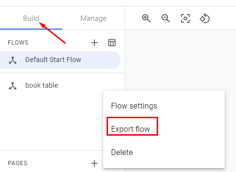


##### 4.1.3.2 导入流：

这里仅展示将本地存储的流文件导入到代理。</br>

步骤： 打开dialogflow cx 控制台 ->点击build -> 点击Flow 右边的 +号 ->选中upload local file -> 点击select file -> 选中本地存储的流文件点击“打开” -> 单击import 按钮</br>

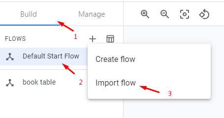

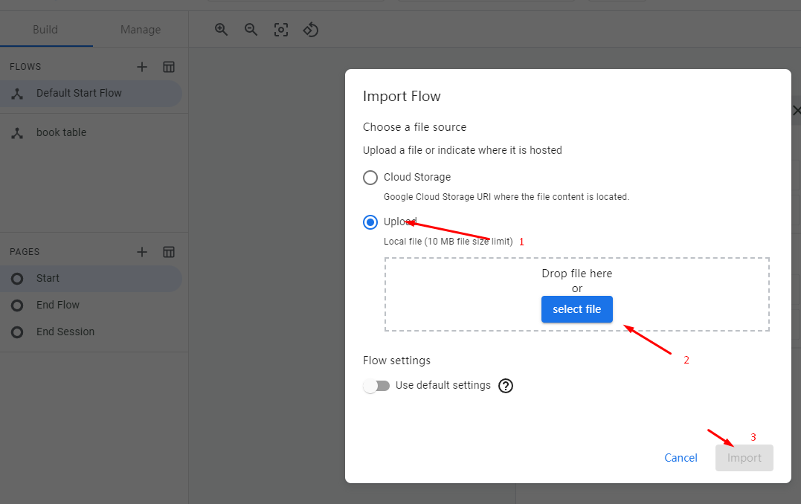


## 4.2 页面 

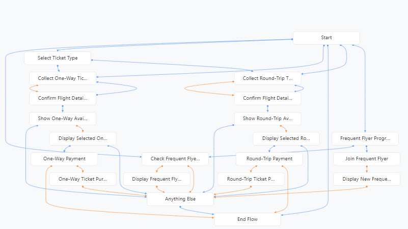


### 4.2.1 页面的特点：

- 上图中的每个节点为一个页面，一轮对话相当于一个状态机，一个页面反应了当前对话的状态。

- 在一个页面里可以添加意图

- 一个页面里包含了所有对话转换逻辑。

- 一个页面包含了intro fulfilment语句和代理回复语句

- 一个流可以由多个页面组成，每个流都有一个初始页面。


页面分为初始页面和普通页面，两者的区别如下：</br>
</br>


### 4.2.2 初始页面的功能

初始页面和普通的页面功能不一，在初始页里，你只可以：</br>

1. 添加意图 </br>

2.不做任何操作，通过条件True执行其他操作</br>

下面展示了如何在初始页添加条件True</br>

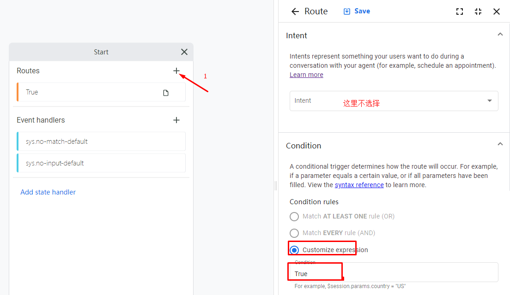

3. 自定义事件Event Handler 事件处理器</br>

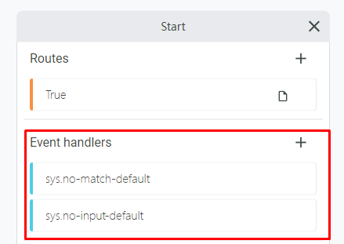


### 4.2.3 普通页面的功能

当进入一个页面时候，页面的执行顺序为：</br>
Entry fulfillment -> Parameter收集（如果有）-> Routes 和 Route Groups（如果有） -> EventHandler（如果我们为当前页设置了事件处理,如果没设置默认调Dafault Start Flow的事件处理）</br>


#### 4.2.3.1 Entry fulfillment 
在这里你可以根据业务逻辑添加回复，或者介绍一类的语句。入口fulfillment会在进入该页时立即被调用。</br>


#### 4.2.3.2 Parameters参数收集
参数分为：</br>
- 意图参数
- 表单参数
- 会话参数

1.意图参数</br>
意图参数在为意图添加训练语句时，系统会自动提取并添加。 </br>

意图使用参数来提取在意图匹配时最终用户提供的数据。以下数据用于定义意图参数：
- 名称（也称为 ID 或显示名）：用于标识参数的名称。
- 实体类型：与参数关联的实体类型。
- 为列表：如果为 true，则该参数会被视为值列表。
- 在日志中隐去 (Redact in log)：如果设置为 true，最终用户提供的参数数据会隐去。</br>
1.1名称
见下图箭头 </br>
我的实体类型为color，下图为color的实体集合

下图为意图训练语句。</br>

1.2.实体类型</br>
实体类型，也就是上图中的Entity entype</br>
1.3.为列表</br>
当你想通过一个意图收集多个同类型实体时使用。</br>
例子：我希望收集用户喜欢的颜色。</br>
在上图训练语句中，我在一条训练语句中标记了color类型的实体中的两个参数,勾选了右边的is List方框。</br>
效果是提取到了用户说的所有颜色实体。</br>

</br>
1.4.在日志中隐去。</br>
 例如，假设最终用户输入“My address is 1600 Amphitheatre Parkway”，则 address 参数会设置为“1600 Amphitheatre Parkway”。日志记录的文字将为“My address is $address_redacted”。</br>
意图参数的引用：</br>
- $intent.params.parameter-id.original 引用实体原名
- $intent.params.parameter-id.resolved 引用用户说出的实体名

2.表单参数</br>
- 为每个页面定义一个表单，该表单上列出应从该页面的最终用户处收集的参数，可以理解为槽位填充。</br>
- 表单参数按照参数的顺序收集。</br>。
- 当前页面可以访问其他页、流的表单参数。访问方式为$session.params.xxx, 访问当前页面的表单参数方式为$page.params.xxx</br>
- 所有的表单参数都会被写入会话参数，在会话期间收集的参数，有效范围为一轮会话，当会话结束时，所有参数会被清空。</br>
注意： 在收集参数的时候注意在先前页或者流中是否已经收集了这个参数，如果已经收集了，假设参数名为name，这时候你在当页再次收集同名参数，就不会产生一个参数收集的执行，系统认为参数已经被收集了，没必要再收集一次。如果在当前页在路由中你加入了参数收集完毕的条件路由，此时将会直接执行该路由。</br>
2.1 表单参数的状态判断：</br>
$page.params.status = "FINAL"  检查当前页面的整个表单是否已填充</br>
$page.params.parameter-id.status = "UPDATED" 检查上轮对话中是否填充了特定表单参数</br>


2.2 设置表单参数：</br>
点击页面的Parameters->填写右侧的参数收集表</br>
Requried的意思是如果你设置了参数的默认值，这里如果勾选Required，就会收集该参数值，而不使用默认值。</br>
isList 和 Redact in Log 的意思请参照上面的解释。</br>

3.会话参数：</br>
当在运行时设置任何类型的参数时，该参数将被写入会话并成为会话参数。这些参数在设计时未明确定义。您可以在会话期间随时引用这些会话参数。</br>
引用会话参数</br>
会话参数引用可用于以下类型的 fulfillment 的静态响应消息中：</br>

页面条目 fulfillment</br>
路由 fulfillment</br>
事件处理程序 fulfillment</br>
表单提示 fulfillment</br>
表单重新提示 fulfillment</br>
引用方式：</br>
$session.params.parameter-id

如：$session.params.color color为收集参数的时候填写的参数名
#### 4.2.3.2 Add state handler 状态处理


state handler 共有三种（如上图）：</br>
- Routes（路由） 决定了对话的逻辑
- Routes groups  一组路由的封装
- Event Handler  用于事件处理
##### 4.2.2.2.1 Routes 路由
1.Routes分为意图路由和条件路由。</br>
什么时候系统将调用Routes？</br>
- 当某个用户意图被命中时候。</br>
- 当某个会话状态的条件被满足时。条件路由的使用情况：</br>
当你需要做参数判断，比如你拿到了会话参数或页面参数，需要将其与一个特定数字做判断。</br>
当你需要拿一个参数，你需要判断他是否在一个集合里。 </br>
条件操作符： </br>
HAS (:) </br>
EQUALS (=) </br>
NOT_EQUALS (!=) </br>
LESS_THAN (<) </br>
LESS_THAN_EQUALS (<=) </br>
GREATER_THAN (>) </br>
GREATER_THAN_EQUALS (>=) </br>


在页面单击"Routes"进入上图的显示界面。</br>
上图的模块解释</br>
- Intent： 选择意图
- Condition: 判断条件
- Fulfillment： 命中意图或条件的时候，代理的回复文字
- Transition： 下一步的操作：
- Transition 决定了会话下一步的走向，在这里可以设置转移到某个Page或者Flow，或者结束对话。</br>

具体用法：
1.Intent：</br>
意思是在当会话进入当前页面时，该意图才有机会被命中，对于没有添加到该页的意图，一定不会当前页面被命中。</br>
在这里可以你可以新增意图及其训练语句，或者加入已建立好的意图，非必选。</br>

1.方式一： 直接新增</br>

点击上图的Routes旁边的加号 -> 输入意图名以及训练语句、根据情况标题参数 ->选中该意图 -> save</br>

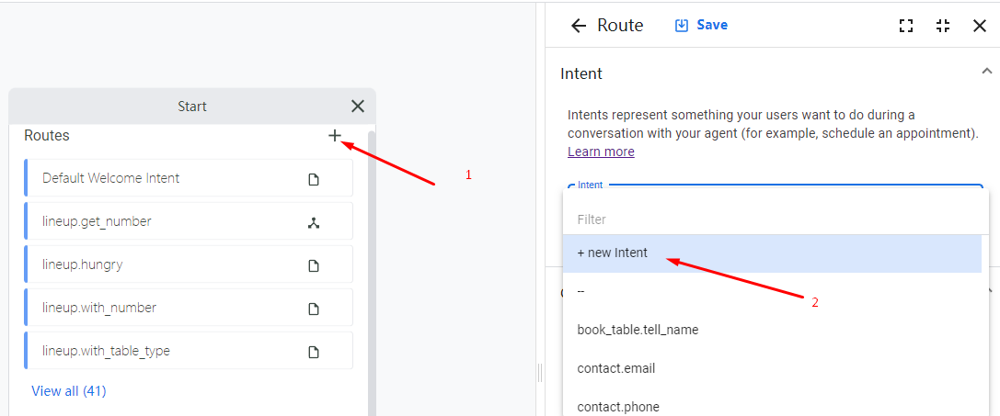

2.方式二： 先在意图管理区新增意图并输入好训练语句、参数标记等 -> 点击routes 右边的 加号 -> 在下拉列表中选中该意图 ->save</br>

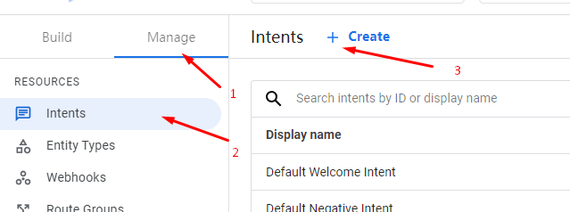

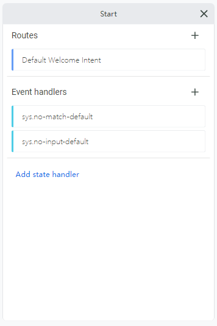
2.Condition: </br>
条件的三个逻辑选项： </br>
2.1.OR</r>
当你设置了多个条件，当其中一个条件被满足，这个路由就会被触发。</br>


2.2 AND</br>
当你设置了多个条件，所有的条件都满足，这个路由才会被触发。</br>
例子：假设你在对话中收集了顾客年龄信息，你现在需要根据顾客的年龄给出不同的回复。</br>
当满足条件 20<顾客年龄<30 才被触发  </br>


2.3.Customize expression</br>
自定义表达式，请将条件判断语句写到这里。</br>
[条件链接](https://cloud.google.com/dialogflow/cx/docs/reference/condition)


3.Fulfillment</br>
代理的回复语句，如果你写了多行，将会以随机的方式选出一句作为回复语句。</br>

4.Transition</br>
当意图路由或者条件路由被触发的时候，页面的走向。</br>

4.1.选中Page单选按钮 </br>
下拉框选项解释</br>
- \+ new Page: 新增页 </br>
- -- 不做什么操作</br>
- page1： 转移到其他页，这里page1为我设置的页面名，这个因您的情况而异</br>
- Start ：转移到该flow的start页 </br>
- End Flow：结束当前flow，使用该session id再次发生会话时，会话的会从Default start flow开始</br>
- End Session：结束会话。</br>
- Previous Page:转移到上一页</br>
- Current Page：转移到本页，如果本页没有有效的转移，可能会导致死循环，慎用！</br>

4.2 选中Flow单选按钮 </br>

下拉框选项解释</br>
- \+ new Flow 新建流</br>
- -- 不做什么操作</br>
- book table 转移到已有的自定义流</br>
- Default Start Flow 转移到代理默认开始流</br>

##### 4.2.3.2.2 Routes Groups 路由组
Route Groups 为路由组，路由组打包了一组路由。当你在多个页面需要多个同样功能的路由时，你可以把这些路由添加到一个路由组。路由组的好处是为了方便移植，在页面A添加了路由组R后，其他页面都可以加入该路由组R，前提是需要加入该路由组到该页面，访问该页面时才会生效。</br>


##### 4.2.3.2.3 Event Handler 事件处理</br>
点击页面 "Add state handler" -》勾选Event Handler，如下图：</br>


上图为设置事件处理的页面，具体说明如下：</br>


## 4.3 意图
我们可以在控制台，或者通过API或Dialogflow客户端库对意图增删改。详情参照链接[链接](https://cloud.google.com/dialogflow/cx/docs/concept/intent)
创建意图的方式：</br>
点击manage -> create->填入意图名，收集参数（如需要）</br>


### 4.3.1 意图匹配
当最终用户输入或说出某些内容（称为“最终用户输入”）时，Dialogflow 会将该输入与意图训练短语进行比较，以找到最佳匹配。此过程称为“意图匹配”。只有与范围内的意图路由（具有意图要求的状态处理程序）关联的意图才会发生意图匹配。</br>
在搜索匹配意图时，Dialogflow 根据“意图置信度分数”（也称“置信度分数”）为潜在匹配项评分。取值范围从 0.0（完全不确定）到 1.0（完全确定）。 在对意图进行评分后，可能会出现以下两种结果：</br>
如果得分最高的意图的置信度得分大于或等于分类阈值设置，则系统会将其返回为匹配项。
如果没有任何意图满足阈值，则系统会调用无匹配事件。</br>
### 4.3.2 默认欢迎意图
创建代理时，系统会为您创建默认欢迎意图。对于某些语言，意图具有简单的训练短语（例如“Hi”或“Hello”），旨在匹配初始最终用户输入。您可以根据需要修改此意图。</br>
### 4.3.3 默认负意图
创建代理时，系统会为您创建默认负意图。您可以将训练短语添加到此意图中作为反例</br>
### 4.3.4 取消意图
取消意图的训练短语应处理通用尝试和主题特有的尝试取消。例如：</br>
取消</br>
停止</br>
我改主意了</br>
不用了</br>
返回</br>
返回</br>
我不想新建预约</br>
取消新预约</br>
删除新预约</br>


## 4.4 实体
### 4.4.1 实体类型
实体分系统实体和自定义实体，这些系统实体可以匹配许多常见数据类型。例如，有用于匹配日期、时间、颜色、电子邮件地址等类型的系统实体。自定义实体是开发者根据需求自定义的实体。</br>
### 4.4.2 “普通实体”和会话实体

会话”表示 Dialogflow 代理与最终用户之间的对话。您可以在会话期间创建名为“会话实体”或“用户实体”的特殊实体。 会话实体可以扩展或替换自定义实体类型，并且仅在为其创建的会话期间存在。 Dialogflow 将所有会话数据（包括会话实体）存储 20 分钟，也就是说从当前会话结束的那一刻开始，在20分钟内，如果没有通过同样的session id来访问该代理，该会话的实体就被被清空。</br>
"普通实体"为本人命名，这是相对会话实体而言的，意思是长期有效的实体。</br>
# 5. 流的版本和环境
## 5.1 概念
草稿：没有环境的代理为草稿，我们在控制台编辑的代理叫草稿。</br>
草稿流：草稿代理种的流为草稿流。</br>
我们可以保存一个草稿流为一个版本，这个版本的流相当于一个快照，包含了该流中原有的实体、路由、意图、网络钩子等信息。</br>
环境：</br>
我们可以新建多个环境用来做开发和测试工作等，在一个环境中我们可以根据需要选择各种版本的流，这些流构成一个代理的版本。</br>
- 每个代理的环境数量上限：20 个</br>
- 每个流的版本数量限制：20个</br>

## 5.2 创建建流版本
关于代理的所有操作dialogflow都提供API、客户端库、控制台三种方式，流的版本创建亦是如此。


## 5.3 创建环境
请根据下图步骤操作：</br>


拿到环境的id：</br>
单击下图右侧中间的copy图标可复制环境的完整路径。</br>


待更新....</br>


